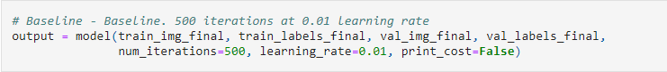

# Classifying Pneumonia

# Overview
Chest x-ray images gathered from Guangzhou Women and Children’s Medical Center are used to create a machine learning model that helps identify the precense of pneumonia in a patient. These images have been resized and vectorized to be the input for two models. A logistic regression model and a central neural network model were used to create classifications of patients and their well-being. These models would be evaluated based on accuracy. The resulting model would be able to correctly identify pneumonia in a chest x-ray with 79% accuracy.

# Business Problem
Doctors have many methods to detect the precense of infections but not all are conclusive. Pneumonia is an infection in the lungs that affects millions every year and can be identified through chest x-rays. While chest x-rays are useful ways to identify pneumonia, the indicators of the infection can be difficult to spot. Doctors also tend to numerous patients and may need to prioritize one over another. A tool to help classify which patients may not be afflicted with pneumonia would help doctors focus on those who may be infected with pneumonia.

A machine learning model that accepts chest x-rays as inputs can be trained to identify patterns of pneumonia and classify patients into two categories: ‘likely to have pneumonia’ or ‘unlikely to have pneumonia'.

# Data Understanding 

The Chest X-ray images are of pediatric patients one to five years old from Guangzhou Women and Children’s Medical Center, Guangzhou. The dataset has been pre-screened for quality control and only contains high quality X-rays for the neural network to learn on. All unreadable or low quality images have already been removed. Three expert physicians diagnosed each of the images the categorization of whether a patients X-ray is positive for pneumonia or not.

The dataset is organized into 3 folders (train, test, val) and contains subfolders for each image category (Pneumonia/Normal). 5,856 Total X-Ray images (JPEG) and 2 categories (Pneumonia/Normal) 3,867 X-Ray images depicting pneumonia 1,349 healthy X-Ray images.


# Data Preparation

We need to preprocess our data before it can be run through a neural network model.

Start with unrowing the train, validation and test images by reshaping them into an 'n x l' shape. This will transform the image shapes from (xxxx, 500, 500, 3) to (xxxx, 750000).

Since this is a deep learning model, we want to make sure each pixel value is between 0 and 1. Therefore we divide the entire matrix by 255 for the train_img_unrow,val_img_unrow and test_img_unrow.
# Modeling

## 1st Model - Convolutional Neural Network (CNN)
Our first model starts off with a convultional layer to read our RGB image. We define the number of filters, kernel_size, strides, activation function, padding (not necessary), input shape (x, y, 3), and the data_format ('channels_last' just means our RGB values are in the last index).

Keeping it simple, we defined kernel_size as (2, 2) and strides as (1, 1).

More filters the better, so we began our model at 32 filters.

Activation function was set to 'relu'.

The MaxPooling2D layer compresses, then enhances the image.

We set the pool_size = (2, 2) and strides = 2.

The next layer flattens the image, meaning transforming our data into a 1D array, scaling the RGB values.

The first Dense layer is the number of neurons that will predict upon the flattened 1D array. This layer is extremely important as its job is to condense a large amount of information into the number of neurons we defince, in this case '128'. We give it an activation function, 'relu' before adding another Dense layer of size 2 with activation 'sigmoid'.

Accuracy Metrics:

Train: 98%
Test: 75%

Now lets see what happens when we increase the number of neurons after our flattening layer from 128 -> 512.

Train: 97%
Test: 81.25%

We seem to have been in underfitting our model, but there is still a large overfitting problem happening with our model. We could keep increasing the number of neurons in hopes of underfitting more, but a different model may yield better results.


## 2nd Model - Logistic Regression


1. Initialize the parameters of the model

2. Perform forward propagation, and calculate the current loss

3. Perform backward propagation (which is basically calculating the current gradient)

4. Update the parameters (gradient descent)


For our first test, we used 500 iterations with a learning rate of 0.01.



Metrics:

Train: 95%

Test: 87.5%

With a difference of 7.5%, between our train and test, overfitting is a problem with our model. Let's see if we can reduce that.

300 iterations at 0.01 learning rate:

Train: 92.4%

Test: 87.5%

We reduced overfitting, but only by 1%. Lets see if we can reduce overfiting further by decreasing the iterations once again, but also decreasing the learning rate.


200 iterations at 0.005 learning rate:

Train: 92.4%

Test: 81.25%

We successfully lowered the training accuracy, however our testing accuracy also took a substantial hit, making our model worse overall.


In this final iteration, we kept the low number of iterations at 200, but increased the learning rate back up to 0.01.

Test: 93%

Train: 87.5%

This seems to be the best overall hyper-parameters to lower overfitting while retaining most most of the predictive power. We scored our final model on the test set to see our final model's accuracy.

Val: 79%
# Results

Because of the similiar metrics, we decided to choose the Logistic Regression model as our final model. Logistic Regression is much simplier to interpret and explain versus a blackbox model such as the Multi-Layer-Perceptron model. Especially in a medical field where explainability holds heavy value.

# Proposals & Use Cases

Do note that our model is 79% accurate, meaning it should NOT replace a doctor's diagnosis, but rather to use in tandem with a doctor's opinion.

We focused on maximizing the accuracy metric since we are creating a tool to prioritize which patients be looked at by a doctor first.

This tool may ultimately aid in expediting the diagnosis and referral of these treatable conditions, thereby facilitating earlier treatment, resulting in improved clinical outcomes.

# Data Limitations
Because the images we used to train our model on is a general x-ray images labeled 'PNEUMONIA' and 'NORMAL', we do not have additional data about the patient. For example, if the patient has a pre-existing condition, how long they had pneumonia for, if they ever had pneumonia but recoverd, etc.

Images with a higher resolution will also help train our model to decipher pneumonia better.

Lastly, because our sample was limited to children ages 1-5 obtained from Ghangzhou, China, collecting samples from different geographical locations would be an important step.

The addition of any of these features will improve our model’s classification accuracy.

# Conclusion

Due to the similiar metrics, we decided to choose the Logistic Regression model as our final model. Logistic Regression is much simplier to interpret and explain versus a blackbox model such as the Multi-Layer-Perceptron model. Especially in a medical field where explainability holds heavy value.

Do note that our model is 79% accurate, meaning it should NOT replace a doctor's diagnosis, but rather to use in tandem with a doctor's opinion.

An implication of this use is the potential for a pneumonia positive patient to have to wait longer for treatment due to being labeled as a false negative. This could prove to be costly as a bacterial pneumonia infection could cause severe damage.

This tool may ultimately aid in expediting the diagnosis and referral of these treatable conditions, thereby facilitating earlier treatment, resulting in improved clinical outcomes.

## For More Information

See the full analysis in the [Jupyter Notebook](./Pneumonia_Classifier.ipynb) or review this [Presentation](./Pneumonia_Classifier.pdf).

For additional info contact [Michael Lee](mailto:baekho5767@gmail.com), [Noble Tang](mailto:nobletang@gmail.com), and [Jakub Rybicki](mailto:jakubryb92@gmail.com).

## Repository Structure

You are in the README.md right now. If you want to take a look at our Jupyter Notebook, go to the 'pneumonia_classification.ipynb' to find our data science steps for you to replicate! The 'data' folder contains the train/test/val datasets we used to train and validate our model. The 'chest_xray' folder contains the images used within this README. We hope you find our research informative!
```                              
├── chest_xray
├── images
├── .gitignore
├── pneumonia_classification.ipynb
├── pneumonia_classification.pdf
└── README.md
